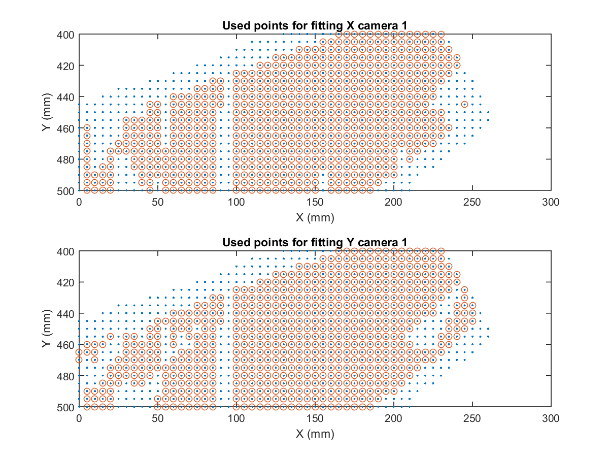

# 3D Profilometry using Laser Triangulation

0. [Abstract](#sec_0) 
1. [Introduction](#sec_1) 
    1.1 [Triangulation methods](#sec_11) 
    1.2 [Quality control for tubular products](#sec_12) 
2. [Experimental setup](#sec_2) 
3. [Calibration using trapezoidal standard](#sec_3) 
    3.1 [Algorithm for finding corners](#sec_31) 
    3.2 [Calibration algorithm](#sec_32) 
    3.3 [Mutual referencing of cameras](#sec_33) 
    3.4 [Diameter measurement](#sec_34) 
    3.5 [Quantifying the error introduced by Taubin's algorithm](#sec_35) 
4. [Conclusions](#sec_32) 

## Abstract 

A 3D laser triangulation profilometry system consisting of two camera-laser pairs was calibrated. The visible field was scanned with a reference object used for the sizing of industrial products, in order to map the points in the camera coordinate system with their corresponding ones in the physical space. 3 variants of this method were studied, using different reference objects: a trapezoidal standard, a hexagonal standard, and an original design featuring 90 corners. These 3 variants were put to the test by measuring 3 cylindrical standards with diameters ranging from 140 mm to 177 mm, obtaining in all cases errors that did not exceed 135 μm. Two of the methods used are extensible to 6 camera-laser pairs. This work was done in the context of an internship at [Tenaris](https://www.tenaris.com/en), which doubled as a Master's thesis in Physics.

## 1. Introduction 

Three-dimensional scanning technologies play a vital role in a wide variety of industries and disciplines, including factory process control, the healthcare sector, civil engineering, forensics and archaeology. Its primary purpose is to create images or 3D models of an object for various uses, such as reverse engineering, quality testing, or reconstruction of historical artifacts.

### 1.1 Triangulation methods 

Of the various existing 3D scanning methods, the most widely used are those in which the target is illuminated with a laser or a fringe pattern. Laser methods fall into 3 categories: triangulation, time of flight , and phase shift. In triangulation methods, a narrow band of light projected onto a three-dimensional surface produces a line of illumination that will look distorted from any perspective other than that of the projector (see figure below). Analysis of the shape of these linear images can then be used to make an accurate geometric reconstruction of the object's surface. There are four main components of a 3D triangulation system: the camera, the linear projector which is typically a laser, a mechanism that moves the object or laser-camera pair through the system's field of view, and the software to process the image, and accurately capture and convert distances between pixels into height differences.

### 1.2 Quality control for tubular products 

At the [Tenaris research center](https://www.tenaris.com/en/sustainability/innovation/), 3D profilometry equipment was developed to measure defects on the surface of tubular steel products for the oil and gas industry. These tubes have diameters in the range of 5.5'' to 9 5/8'' (140 to 244 mm). International quality standards require that surface defects do not exceed 5% of the tube wall thickness, which ranges from 4.5 mm to 12 mm depending on the product. The defects to be resolved have dimensions ranging from 300 μm to 600 μm. For the present work, an equipment was developed based on laser triangulation. There are precedents on commercial equipment of this kind by companies such  as [IMS](https://www.ims-gmbh.de/?lang=en) ans [SMS](https://www.sms-group.com/).

For this purpose, a reduced system consisting of 2 arms instead of 6 was assembled, in order to capture the essential characteristics of the problem, such as the inclination between the arms and the distance to the center of the system. The figure below shows a diagram of the reduced system built for this work.

## 2. Experimental setup 

In order to assemble a system like the one seen above, two lasers were used: an Osela Streamline and a Coherent StingRay, with a wavelength of 660 nm, a fan angle of 20°, and focused at 390 mm. The width of the laser line was approximately 200 µm. Automation Technology C2-2040 high-speed cameras were used, with a resolution of 2048 x 1088 pixels, which were operated at a speed of 333 fps. Spacecom Pyxis 12 lenses and Midopt BP660 bandpass filters in the 640-680 nm range were used together with the cameras.

Cameras and lasers were mounted onto two arms with a relative inclination of 60°, with a camera-laser angle of 45°. The figure below shows a general view of the experimental setup.

## 3. Calibration using a trapezoidal standard 

As mentioned previously, the goal of this work is to calibrate the system by scanning the entire field of view of the cameras with a reference object fixed to the positioners, whose position can be measured with great precision. Then the transformation that goes from the coordinate system of the cameras to that of the positioners is modeled. Finally, with this model it is possible to transform the images captured by the cameras to lengths in the physical world, and thus measure defects in tubes with great precision. An Automation Technology trapezoidal standard was used. This standard was placed so that two of its corners are oriented towards the two cameras, as shown in the figure below. Corners 1 and 2 were detected with cameras 1 and 2 respectively.

### 3.1 Algorithm for finding corners 

The purpose of this algorithm is to identify the 2 straight lines that define the visible corner in the sensor (if any) and find their intersection. The algorithm consists of the following steps:

1. First, a profile is identified in the central region of the scan.
2. Then all the profiles are sorted by proximity with respect to that first profile.
3. For the first profile, the user provides the coordinates of the corner by clicking on it when prompted (see figure below).

4. Starting from coordinates (*x*0, *y*0) given by the user, the algorithm divides the profile in two, to the left and to the right of $x_0$. It takes a range of 40 pixels on either side of $x_0$ and fit each of the two regions by straight lines. It then improves the fit by performing an iteration in which it discards the points that are more than 3 standard deviations away from the fit, and refits with the remaining points. In this way, it finds the lines that best fit the two faces of the corner, and calculates its coordinates as the intersection of the two straight lines.
5. Once the corner of the first profile is found, the algorithm continues with the next closest to the first. In this case it is no longer necessary for the user to provide an initial estimate of the position of the corner. Instead the algorithm takes a cutout of the first profile, from the vicinity of the recently found corner, and compares the new profile with the corner already found until it identifies the region of the new profile that most resembles the previous corner. In the figure below we can see the new profile (red) along with the previous corner (blue).

The previous corner (blue) sweeps the new profile from left to right, with an incremental step of 1 pixel. At each point the difference between both profiles is calculated, as shown in figure below.

The goal is to have a measure of how similar the two profiles are at each step of the scan. To do this, at each step all the points of the difference are summed up. That is, all the $y$ coordinates in the figure above. Figure below shows the result, where it can be seen that in the first 500 pixels, as well as in the last 500, the difference between the new profile and the previous corner is constant, because the new profile has a constant value in those regions.

However, the curve has a minimum, where the previous corner aligns with the corner of the new profile (see figure below).

6. At coordinate $x$ of said minimum, the process described in step 4 is repeated to find the corner of the new profile.
7. The algorithm continues finding the corners of the remaining profiles, in order of proximity to the first one, until it has found 10 corners. At that point, the algorithm implements a faster method to obtain the first estimate of the next corners. This method no longer consists in comparing with a reference corner, but in taking the 10 corners already found and plotting the $x$ coordinate of the corner (in pixels) based on the $x, y$ coordinates in millimeters of the corresponding profile. That is, the coordinates of the linear stages on which the profile was mounted. This is shown in figure below in red dots. These points are fitted by a second degree polynomial, as shown in the same figure. The algorithm then takes the $x,y$ coordinates of the next profile (in millimeters) and uses them to evaluate the polynomial. In this way it obtains an estimate of the position of the corner in the new profile (blue dot in the figure below). Then it repeats step 4 to improve the accuracy for the coordinates of the new corner.

8. The algorithm continues in this way until the profiles are exhausted.

Once all the profiles have been processed, the figure below is obtained, which shows the $x$ and $y$ coordinates of the linear stages for which it was possible to find an intersection with any of the two cameras.

The figure below shows the coordinates in pixels of the intersections as a function of $x$ and $y$. After finding all available intersections with each camera, each was calibrated individually as described in the next section.

### 3.2 Calibration algorithm 

Having the coordinates for each point in the two reference systems (pixels and millimeters), the system is calibrated by finding a model that fits the transformation that leads from one space to another. The figure above shows scatter plots for this transformation, where it can be seen that the functions are smooth. For this reason it was believed that low degree polynomials would provide an accurate fit. First, second degree polynomials were tried, but it was observed that the residuals had a noticeable structure, which indicates that the fit was not good enough. The degree was then increased until no structure was observed for the residuals, which happened at order 4.

To give the polynomial fits a better quality, some points considered less reliable were omitted: those in which the linear fit for one of the 2 straight lines had a standard deviation greater than 0.4, and also those for which one of the 2 straight lines had less of 100 points. The two figures below show the points discarded with this criterion.

The polynomial fit was carried out iteratively to rule out points whose error with respect to the model exceeded 3 standard deviations. The two figures below show the points used for fitting.

The two figures below show the difference between the measured coordinates of three-dimensional space and those predicted by the model, given by the inverted polynomials, on the sensors.

### 3.3 Mutual referencing of cameras 

Having both cameras calibrated, it is possible already to measure dimensions with either of them. However, the measurements of one and the other will differ from each other by a translation. This is so because each camera was calibrated taking a different corner of the trapezoid as a reference. Then the measurements of both cameras will differ in the translation that goes from one corner of the trapezoid to the other. To solve this problem, it is necessary to determine the magnitude of the translation, and compensate it by offsetting the calibration of one of the two cameras. To determine the magnitude of the translation, we sought to measure the same corner with both cameras, and calculate the difference between both measurements. This was done as follows:

1. The trapezoid was located so that the two cameras can see the same corner, as shown in figure below. This way the standard was in a horizontal position.

2. A sweep was made detecting this corner with both cameras, in the entire visible field. 
3. The points obtained were transformed to millimeter space, using our brand new calibration. In the figure below it can be seen that the profiles measured by the two cameras have a relative offset, which is equal to the offset between two corners of the trapezoid.

4. For each scan point, the translation between the coordinates of the corner measured by camera 1 and those given by camera 2 is calculated. The components $x$ and $y$ of the translation for each scan point are shown in figure below. In these figures it can be seen that the offset between cameras remains quite uniform in the $x,y$ plane, with a certain variation in the region of smaller $x$.

5. The average value of the two distributions shown in the figures above is calculated, and it is used to apply a translation to the polynomials corresponding to one of the cameras. In this way, both cameras are referenced to a common origin.

### 3.4 Diameter measurement 

Once the two calibrations were referenced to a common origin, the data from both cameras was combined and fitted by a circle. For this, an algebraic algorithm developed by Brown University's mathematician [Gabriel Taubin](https://engineering.brown.edu/people/gabriel-taubin) was used. The figure below shows the data measured by the cameras (in blue and red), together with the circle that best fits them (black dotted line).

The figure below shows the radial error of the fit.

The table below shows the difference between the measured and real diameter of each standard, both measuring with a separate camera and combining the data from both.

| Diameter (mm) | C1 error (μm) | C2 error (μm) | Total error (μm) |
| --------------|---------------|---------------|----------------- |
| 139.707       | -245          | -5            | -147             |
| 168.310       | -172          | 186           | -168             |
| 177.805       | -166          | 204           | -157             |

### 3.5 Quantifying the error introduced by Taubin's algorithm 

Since the method for measuring the diameter of cylindrical standards requires the use of Taubin's algorithm, we studied how the quality of the fit is affected by the available angular aperture. For this, an ideal circle of 178 mm in diameter was defined, and the experimental error was simulated by adding a normal distribution to the components $x$ and $y$. This distribution was centered at 0, but its standard deviation was equal to 100 µm. The figure below shows a semicircle generated in this way.

1000 equivalent samples were randomly produced, measuring the diameter in each case using Taubin's algorithm. The difference between this measurement and the theoretical value (178 mm) was calculated, and the results were plotted in the histogram shown in the figure below.

The standard deviation of this distribution was taken as a measure of the error incurred. It is expected that the measured diameter will be less accurate the smaller the available arc. To study the limits of this method, the process was repeated, shrinking the visible angle more and more. Half circles were generated, and then the arc was progressively reduced by 10°. The figure below shows the error in the measured diameter, as a function of the angle.

As can be seen, for profiles of more than 50° the error is less than 3 μm, while below 20° it increases above 16 μm. This allows us to conclude that the fit of the circle using Taubin's algorithm does not introduce a significant error.

## 4. Conclusions 

A 3D laser triangulation profilometry system consisting of two camera-laser pairs was calibrated. The visible field was scanned with a reference object used for the sizing of industrial products, in order to relate the points in the camera coordinate system with their corresponding ones in space. 3 variants of this method were studied, using different reference objects: a trapezoidal standard, a hexagonal standard, and an original design featuring 90 corners. These 3 variants were put to the test by measuring 3 cylindrical standards with diameters ranging from 140 mm to 177 mm, obtaining in all cases errors that did not exceed 135 μm. Two of the methods used are extensible to 6 camera-laser pairs. All the measurements made had the sought precision.